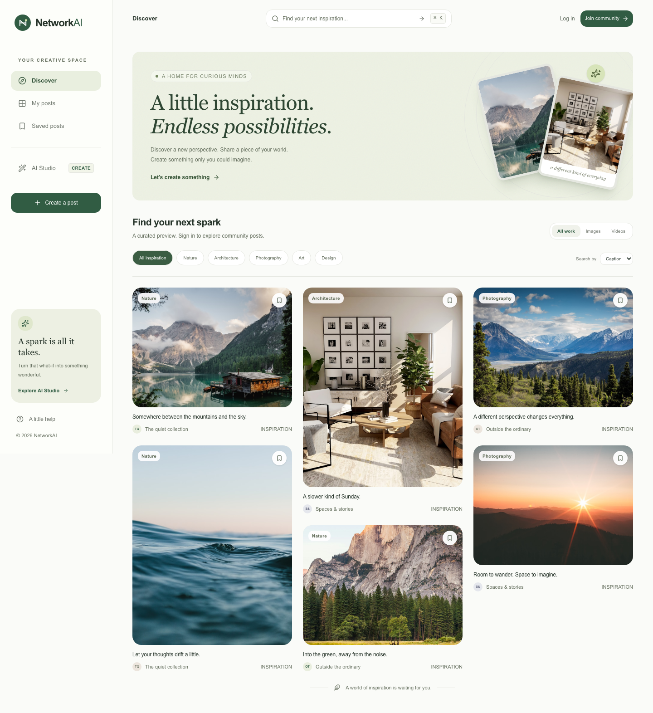

# NetworkAI

A creative social space built with **Next.js App Router, React, TypeScript, Tailwind CSS, and shadcn/ui**. The frontend uses the original Go REST API and JWT authentication, with Elasticsearch behind the existing search endpoint. No Go or Elasticsearch changes are required.



[View the mobile preview](docs/screenshots/discover-mobile.png).

## Run locally

Use Node.js 22.13+ (Node 24 LTS is also supported).

```sh
npm ci
cp .env.example .env.local
npm run dev
```

Open [localhost:3000](http://localhost:3000). The signed-out home includes clearly labeled, locally bundled inspiration photos, so the interface is usable without backend credentials. Signing in switches to real community data. Failed API calls display a retry state; example posts are never substituted for a failed live feed.

Configure these variables in `.env.local` or your frontend hosting environment:

| Variable | Purpose |
| --- | --- |
| `NEXT_PUBLIC_API_BASE_URL` | Existing Go service, defaults to `https://socialai-496702.uw.r.appspot.com`. Public, fixed at frontend build time. |
| `OPENAI_API_KEY` | Server-only OpenAI credential with access to `gpt-image-2`. Required only for AI image creation/editing. |

The old `REACT_APP_OPENAI_KEY` is deliberately no longer used. Move that credential to `OPENAI_API_KEY`; never add a `NEXT_PUBLIC_` prefix. No OpenAI secret is bundled into the client.

## Product flows

- **Discover:** recent community images and videos, caption or exact-creator search, topic shortcuts, loading/error/empty states, accessible media detail dialogs, and incremental display of loaded results.
- **My posts:** authentication-gated access, searches `/search?user=...`, then filters the returned personal captions locally. This avoids assuming the API combines user and keyword filters.
- **Create a post:** caption, image/video upload, validation, media preview, duplicate-submit protection, and clear pending/error states.
- **AI Studio:** prompt suggestions, image generation, image-to-image refinement, download, caption, and publication through the existing upload endpoint. Preview photography is attributed as inspiration, not generated work.
- **Accounts:** registration, login, logout, persisted JWTs, expiry handling, legacy token migration, rejected-session cleanup, and cross-tab session synchronization.
- **Saved posts:** browser-local, account-scoped bookmarks. They do not claim server persistence or cross-device synchronization.
- **Drafts:** captions and AI prompts persist per account in the current browser tab; media remains in memory until reload. Drafts are cleared after successful publication.
- **Responsive navigation:** persistent desktop sidebar, mobile bottom navigation, labeled controls, keyboard focus, reduced-motion support, and a skip link.

**Published-post editing is intentionally omitted:** the existing client has no update API contract, and the requested scope is to use only existing endpoints. Draft text and generated images remain editable before publishing. Users can delete their own published posts after confirmation.

## Unchanged Go API contract

| Operation | Request | Response |
| --- | --- | --- |
| Register | `POST /signup`, JSON `{ username, password }` | Successful status |
| Sign in | `POST /signin`, JSON `{ username, password }` | JWT as plain text (a JSON string is also accepted) |
| Recent posts | `GET /search` with `Authorization: Bearer <token>` | Array of posts, or `null` for an empty Go slice |
| Caption search | `GET /search?keywords=<encoded keyword>` | Array of posts |
| Creator / personal posts | `GET /search?user=<encoded username>` | Array of posts |
| Create | `POST /upload`, multipart `message` and `media_file` | Successful status |
| Delete | `DELETE /post/<encoded id>` | Successful status |

Post shape: `{ id: string, user: string, message: string, url: string, type: "image" | "video" }`. JWTs are sent on all protected requests. The backend remains responsible for validating tokens and enforcing ownership; decoded browser claims only drive UI/session behavior. No refresh-token endpoint exists, so expired sessions require signing in again.

The original browser-local `token` key is retained for migration compatibility. Because the Go contract returns bearer tokens to the browser, this implementation uses local storage and avoids rendering untrusted HTML. Moving to HttpOnly session cookies would be a separate authentication-contract change.

## Secure frontend AI boundary

`POST /api/ai/image` is a **Next.js route handler**, not a new Go endpoint. It receives the existing bearer JWT and multipart `{ prompt, image?, size? }`, verifies the token against the existing Go `/search`, then calls OpenAI with the server credential. It returns `{ image: "data:image/png;base64,...", model: "gpt-image-2" }`.

- Same-origin request validation and no-store responses.
- Authentication fails closed when the Go service is unavailable.
- 4,000-character prompt limit, bounded request size, and PNG/JPEG/WebP signature checks for image edits.
- Image uploads up to 10 MB; ordinary post videos up to 50 MB in the browser.
- AI cancellation, upstream timeouts, and sanitized errors.
- Explicitly uses `gpt-image-2`; it never silently substitutes another model.

Sources: [OpenAI image model](https://developers.openai.com/api/docs/models/gpt-image-2), [image generation guide](https://developers.openai.com/api/docs/guides/image-generation), [Next.js App Router](https://nextjs.org/docs/app), [shadcn/ui](https://ui.shadcn.com/docs/installation/next).

## Validation

```sh
npm run lint
npm run typecheck
npm test
npm run build
npx playwright install chromium
npm run test:e2e
```

Unit tests cover the actual JSON/multipart API contracts, JWT lifecycle, and AI authentication, validation, provider requests, and errors. Browser tests intercept both the Go and AI services to exercise desktop/mobile product workflows without creating real accounts, publishing posts, deleting data, or incurring image-generation charges.

At migration time, the configured App Engine URL returned a Google 404 on a read-only request. Real backend and paid image-generation integration have therefore **not** been verified. Restore the service or set a working `NEXT_PUBLIC_API_BASE_URL`, configure `OPENAI_API_KEY`, and complete live smoke testing before deployment.

## Deployment

```sh
npm run build
npm start
```

Deploy the frontend on a Node-capable Next.js host. Static export is not supported because the AI route must keep the OpenAI key on the server. The Go service remains on Google App Engine, and Elasticsearch remains on Google Compute Engine. Set the public API URL before building, permit the frontend origin in the existing API's CORS configuration, and supply the OpenAI secret only to the frontend server runtime. The AI handler allows up to 240 seconds with a 180-second upstream timeout, so configure the frontend host's function timeout accordingly.

## Preview photo credits

The six bundled JPGs are editorial inspiration assets from Unsplash, not user posts or AI output. Original sources: [alpine lake](https://images.unsplash.com/photo-1470770841072-f978cf4d019e), [mountain](https://images.unsplash.com/photo-1464822759023-fed622ff2c3b), [interior](https://images.unsplash.com/photo-1600210492486-724fe5c67fb0), [ocean](https://images.unsplash.com/photo-1518837695005-2083093ee35b), [forest](https://images.unsplash.com/photo-1472396961693-142e6e269027), [landscape](https://images.unsplash.com/photo-1500534623283-312aade485b7). Images are stored locally to avoid third-party image requests when browsing the preview.
